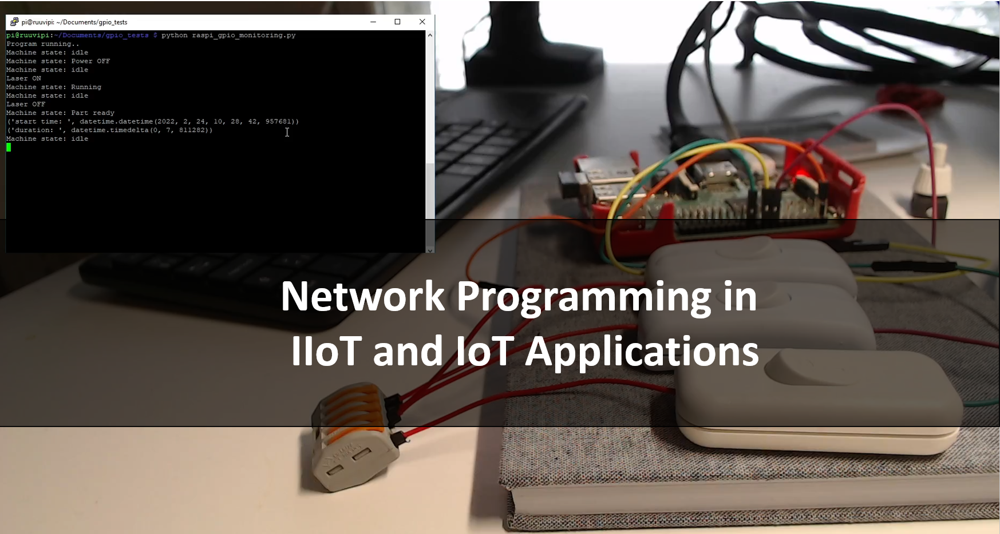

# 2020-1-FI01-KA203-43 Collaborative IOT- Project (Erasmus+)

# Principles of network programming

info
last updated

## Table of Contents

## Course Description
The target of the learning module is that the student can develop distributed information systems for the field of industrial automation and IIoT. The contents of the course are the following:

- Principles of network programming

- client-server-based architecture

- sockets

- concurrent programming

- REST API (Nodejs Marko + mongodb) (Juha Python Flask sqlite)

- MQTT

- web-based applications for IIoT and IoT platforms

- cloud services

## Prerequisite

## Course Outline

### Lecture Video

## Tasks
