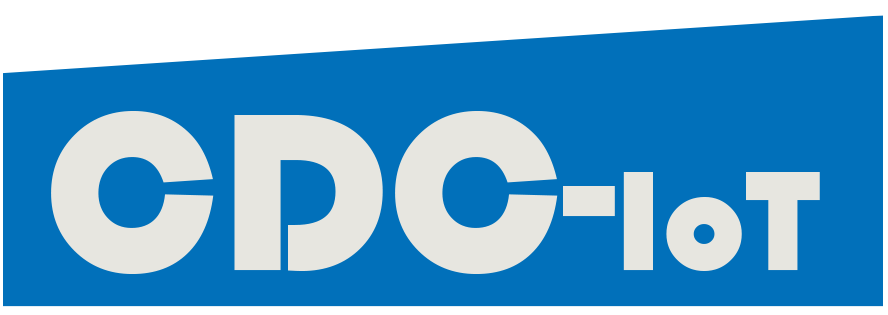

# 2020-1-FI01-KA203-43 Collaborative IOT- Project (Erasmus+)

# Principles of network programming

info: last updated

## Table of Contents
- [**Course Description**](#course-description)
- [**Intended Learning Outcomes**](#intended-learning-outcomes)
- [**Prerequisite**](#prerequisite)
- [**Course Outline**](#course-outline)

## Course Description
The target of the learning module is that the student can develop distributed information systems for the field of industrial automation and IIoT. The contents of the course are the following:

- Principles of network programming

- client-server-based architecture

- sockets

- concurrent programming

- REST API (Nodejs+mongodb, Python Flask sqlite)

- MQTT

- web-based applications for IIoT and IoT platforms

- cloud services

## Intended Learning Outcomes
By the end of this course, students should be able to:

- develop distributed information systems for the field of industrial automation and IIoT. 

After completing the course, the student knows:

-  the most important network programming techniques relevant to IIoT applications
-  how to collect data from devices
-  how to send data to server application or IoT platform by using HTTP protocol or MQTT.

In addition, the student can develop a simple web application, which receives the data, stores it to the database, and shows it in web page. The student can utilize IoT platforms and IoT related cloud services effectively.

## Prerequisite

## Course Outline

Tools and software required:
- [Visual studio code](https://code.visualstudio.com/)
- [Nodejs](https://nodejs.org/en/)
- [Python](https://www.python.org/downloads/)
- [Postman](https://www.postman.com/downloads/)
- [MQTTBox](https://www.microsoft.com/en-us/p/mqttbox/9nblggh55jzg?activetab=pivot:overviewtab)

Class|Topics|Slides|Tutorial|Load|ETF|Homework|
|:----|:-----|:----|:-----|:-----|:-----|:-----|
|Class x|**Sockets**|[slide](sockets/)||x|x||

### Lecture Video

## Tasks
