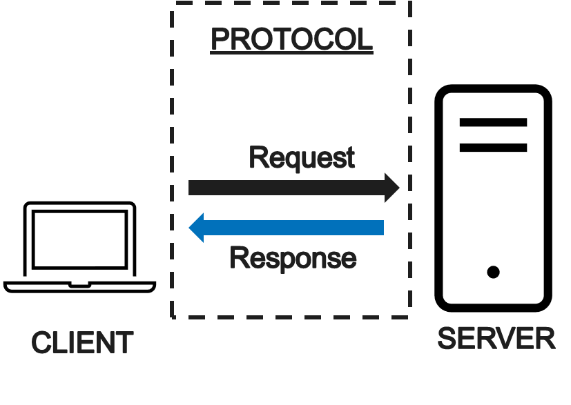
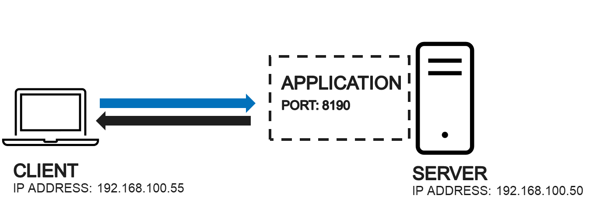
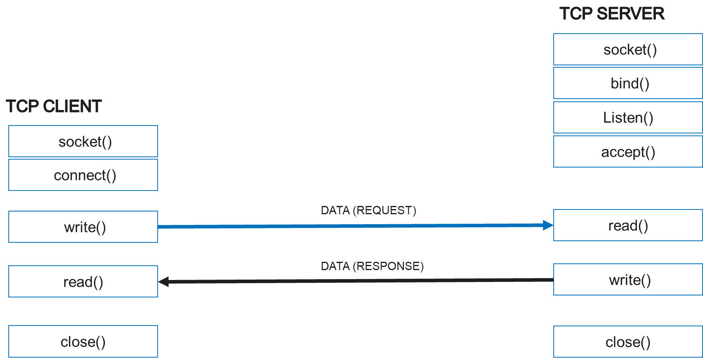

# Sockets

## Basics

**Server**
is computer software that waits for customer service requests. The server responds to the client's requests by offering services or resources. Process takes action only when asked to do something on behalf of a client

**client**
active party that generates request, send them to a server and does something with the result that it gets back

**Protocol**
the language or set of rules how client and server communicate between each other. Servers and clients must use a common protocol to understand each other



**Course book**

[Stevens W. R., Fenner B., Rudolf A.M: UNIX Network Programming, Volume 1, 3rd Edition , Addison Wesley, 2004. The course covers the chapters 1-8, 11-17, 20-26 and 30 plus Appendixes A-D of the course book.](https://github.com/sqm2050/wiki/blob/master/Books/c%26programme/UNIX%20Network%20Programming%2C%20Volume%201%2C%20Third%20Edition%2C%20The%20Sockets%20Networking%20API.pdf)


## Socket

- A socket is a communications connection point (endpoint) that you can name and address in a network. 
- Endpoint consists of an IP address and a port number 

```
[IP ADDRESS]: [PORT NUMBER]
EXAMPLE: 192.168.100.55:8190
```
- Sockets are commonly used for client and server interaction. Typical system configuration places the server on one machine, with the clients on other machines. The clients connect to the server, exchange information, and then disconnect.

## IP Address and port

- Socket connection uses the TCP protocol for communication
- IP address identifies the computer in the network
- Port identifies the application or service running on the computer




```
Commonly used ports:

FTP (File tranfer) port 21
SSH (secure shell) port 22
TELNET port 23
SMTP (e-mail) port 25             
DNS port 53
HTTP port 80
HTTPS (secure web browsing) port 443

```
[IANA.ORG -List of registered port numbers](https://www.iana.org/assignments/service-names-port-numbers/service-names-port-numbers.xhtml)

## Socket communication

**Client setup**
1. Connect to same network with server
2. Look up the address of a server
3. Create client socket
4. Connect to the server using ip address and port

**Server setup**
1. Create socket server
2. Setup socket server
3. Bind created socket to spesific port
4. Listen for new connections from clients
5. Accept new connections



TCP Socket flow

## Socket communication example (Python)

Python socket module provides access to the BSD socket interface.
[Python socket library documentation](https://docs.python.org/3/library/socket.html)

### Basic functions

Socket functions and methods included this module are:

socket()
- .bind()
- .listen()
- .accept()
- .connect()
- .connect_ex()
- .send()
- .recv()
- .close()

In order to use these functionalities, the socket module must be imported. 

```python
import socket

```
Next, the IP address and port of the socket server are defined. The IP address must be entered as a string and the port as an integer

```python
import socket

HOST = "127.0.0.1"
PORT = 8991

```

```python
# socket object parameters 
socket(family, type) 

```

First we need to define which kind of address family and type our server uses. 
Python socket module support different address families and selected family determines the format of the address structure to be used on socket 

Address families
- AF_UNIX
- AF_INET (uses the Internet Protocol version 4, IPV4) **default**
- AF_INET6 (uses the Internet Protocol version 6, IPV6)
- AF_CAN
- AF_PACKET
- AF_RDS

> A pair (host, port) is used for the AF_INET address family, where host is a string representing either a hostname in internet domain notation like 'daring.cwi.nl' or > an IPv4 address like '100.50.200.5', and port is an integer.

[Python socket documentation - socket families](https://docs.python.org/3/library/socket.html#module-socket)

[More information about Internet protocol](https://www.cloudflare.com/learning/network-layer/internet-protocol/)

Selectable socket types are:
- SOCK_STREAM (TCP) **default**
- SOCK_DGRAM (UDP)
- SOCK_RAW
__

### Socket server

Lets build our first simple socket server.

**STEP 1. Create simple socket server**

```python
import socket

HOST = "127.0.0.1"
PORT = 8991

```

```python

# Let's set up a server that uses the AF_INET address family and the TCP protocol
tcp_server = socket.socket(socket.AF_INET,socket.SOCK_STREAM)

```
> Bind the socket to address. The socket must not already be bound. (The format of address depends on the address family — see above.)

```python

# let's bind the server to the IP address and port given above
tcp_server.bind((HOST,PORT))

```

**STEP 2. Enable a server to accept connections**

> Listen specifies the number of unaccepted connections that the system will allow before refusing new connections

```python

tcp_server.listen(5)

```


