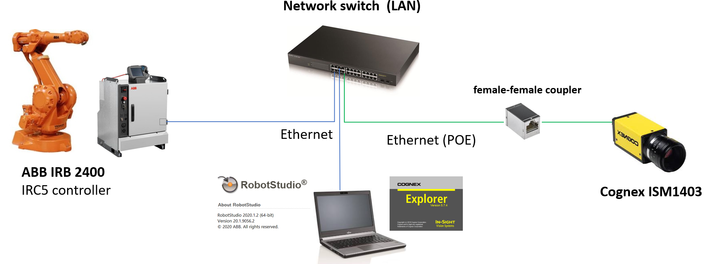

# Socket example (Cognex machine vision TELNET interface)

> The In-Sight Native Mode protocol is an ASCII protocol that allows an In-Sight sensor to be controlled from any of the following:

> - Custom application programs running on a PC.
> - Remote hosts that support standard serial communications.
> - Telnet over an Ethernet network.

> The Native Mode protocol is divided into two sets of commands: Basic and Extended.
> - Basic Native Mode commands are two characters long, plus parameters (if any) and a terminator character.
> - Extended Native Mode commands include additional functions or commands.
> The commands are not case sensitive. The terminator is CR + LF (ASCII characters 13 + 10) when sending Native Mode commands using a telnet connection. When using Native > Mode commands over a serial port, an alternate terminator character may be specified in the Native Mode Details.
> The default terminator is CR (ASCII character 13).

> When a Native Mode command is remotely issued to an In-Sight sensor, the In-Sight sensor processes the command and then returns a response, consisting of an ASCII > string followed by the terminator character.

> Commands that set values return 1 for "success", 0 for "unrecognized command", or a negative number for "failure".
> Commands that get values return various values, depending on the command.

Source: [Cognex cocumentation - Native mode commands](https://support.cognex.com/docs/is_613/web/EN/ise/Content/Communications_Reference/NativeMode_Commands.htm?tocpath=Communication%20Reference%7CNative%20Mode%20Communications%7C_____1)

[Documentation- Set event and wait](https://support.cognex.com/docs/is_613/web/EN/ise/Content/Communications_Reference/SetEventAndWait.htm)

[Documentation - Get cell value](https://support.cognex.com/docs/is_580/web/EN/ezb/Content/Communications_Reference/GetCellValue.htm)
